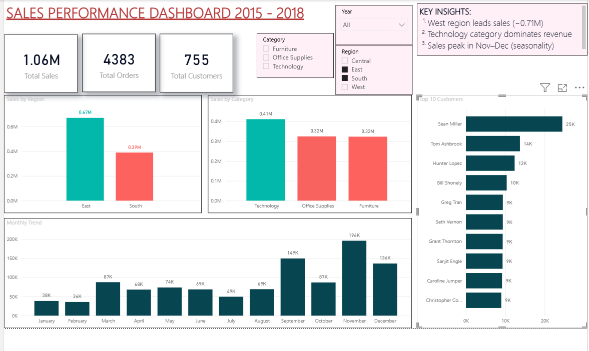

# 📊 Sales Performance Analysis

## 📌 Project Overview

This project analyzes sales data to identify key business insights related to regional performance, product categories, customer behavior, and sales trends.

## 🛠️ Tools Used
- SQL (MySQL) – Data cleaning and analysis
- Power BI – Interactive dashboard creation

## 🔍 Key Insights
1. The West region generates the highest sales, indicating strong market performance.
2. Technology is the top-performing category in terms of revenue.
3. Sales show peaks during November–December, suggesting seasonal demand patterns.
4. Revenue is concentrated among a small group of high-value customers, indicating potential dependency risk.

## 📈 Dashboard Features
1. KPI cards for total sales, orders, and customers
2. Sales breakdown by region and category
3. Monthly sales trend analysis
4. Top 10 customers by revenue
5. Interactive filters for region and category
## 📂 Files Included
- Sales performance Dashboard.pbix – Power BI dashboard
- Sales.sql – SQL queries used for analysis
- Dataset (source: Kaggle Superstore dataset) - train.csv

## 📊 Business Recommendations
- Focus marketing efforts in high-performing regions like the West
- Diversify customer base to reduce dependency on top customers
- Plan inventory and promotions around peak sales months

## 🚀 Conclusion

This project demonstrates how data analysis and visualization can be used to uncover actionable business insights and support decision-making.

